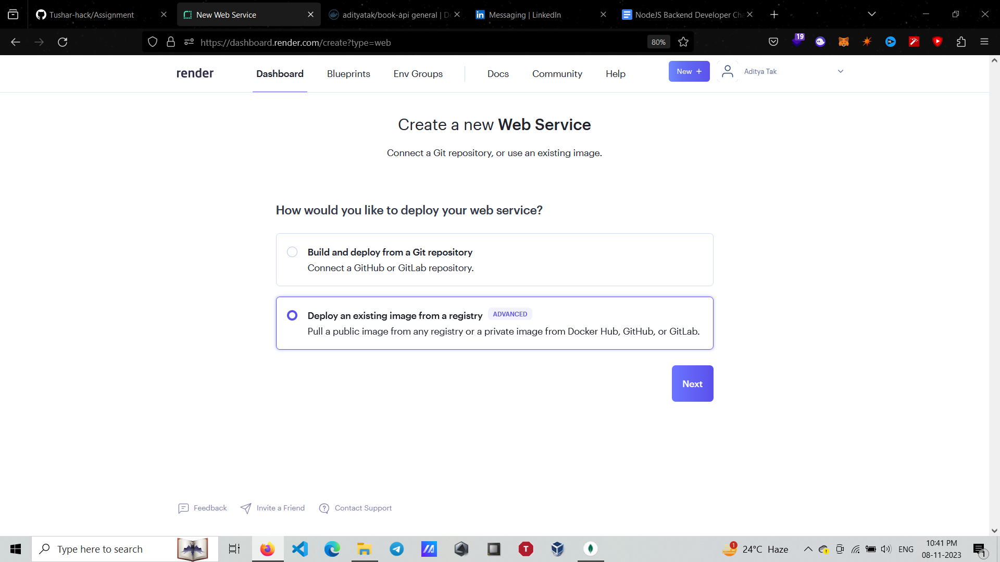
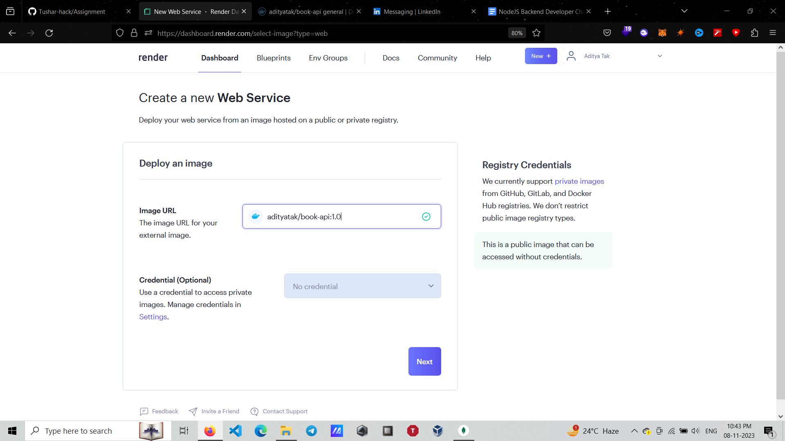
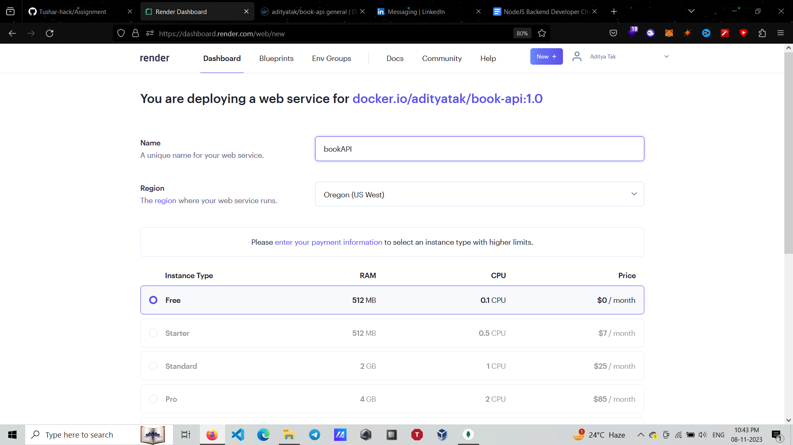
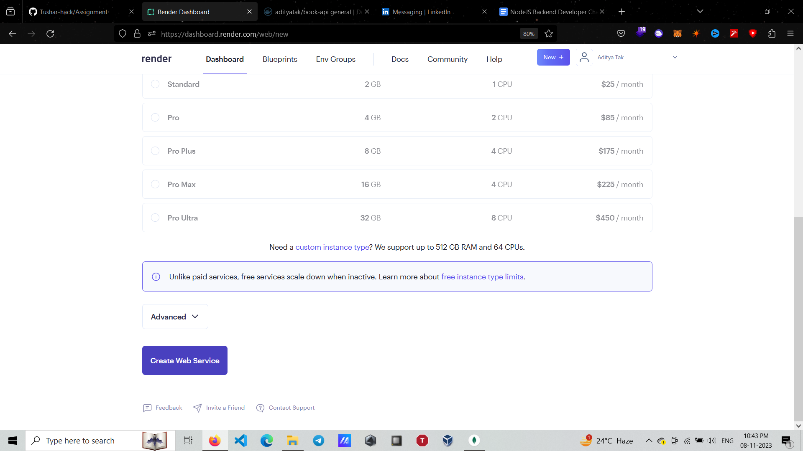
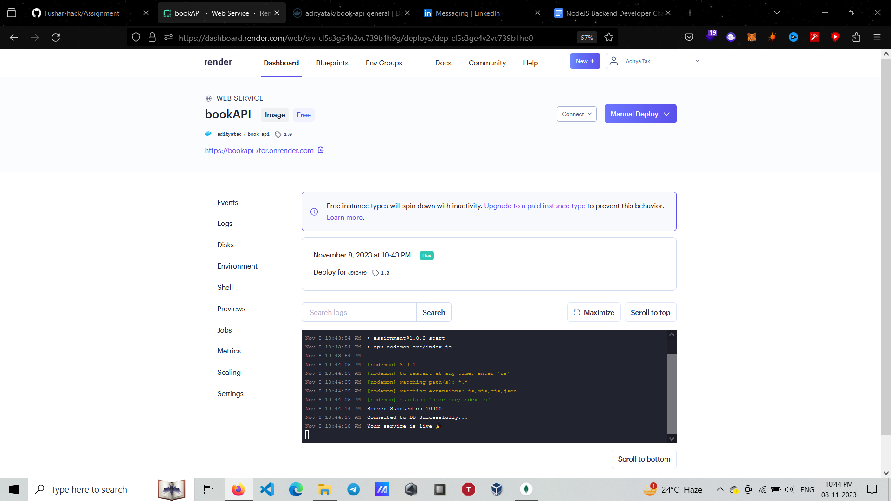

# How to get Started Locally
    - Clone the Repo in your Working Directory.
    - Make sure Node is installed in your system.
    - Make sure MongoDB Community Server is installed in your system and Running.
    - Run : 
        ```npm install```
         ```npm start```

# Deployment Process
    - Prerequisites
        - A Render.com account. Sign up at https://render.com if you don't have one.

    - Log in to your Render.com account.


    - In the Render dashboard,locate the "Web Services" section.
    - Click the "New Web Service" button.
    

    - In the next stage, you will have two options to deploy your application: using a Git repository or an existing public image. Choose "Deploy an existing image from a registry" and click "Next."
    

    - In the next step, you need to specify the URL for the external image. If the image is private, also provide the credentials to access the image. Then, click "Next."
    

    - On the following page, provide a name for your Web Service and select the region where you want to deploy it.
    

    - Scroll down, and click on "Create Web Service."
    

    - It may take around 15-20 seconds for your server to start.
    - After a successful deployment, your dashboard will resemble the following:
    

    -Congratulations! You have successfully deployed a Node.js application as a Docker container on Render.com.

# Books Endpoints

    Note: All data should be sent in JSON.

    - Create a Book
        - Path : /api/v1/books
        - Method : POST
        - Request Body : {
            "title" : "Book-1",
            "author" : "Tushar",
            "genre" : "Fiction",
            "pubYear" : 2001
        }
        Note : All fields are Necessary.
        - Response Body : 
            - On_Success : {
                data: created_book_data,
                success: true,
                message: 'Successfully created the Book',
                err: {}
            }
            - On_Error : {
                data: {},
                success: false,
                message: "Message_Here",
                err: "Explanation_of_Error_Here"
            }
    
    - Get all Books
        - Path : /api/v1/books
        - Method : GET
        - Request Body : {
            // Nothing To Pass Here
        }
        - Response Body : 
            - On_Success : {
                data: [{Book_1}, {Book_2},...],
                success: true,
                message: 'Successfully fetched all the Books.',
                err: {}
            }
            - On_Error : {
                data: {},
                success: false,
                message: "Message_Here",
                err: "Explanation_of_Error_Here"
            }
    
    - Get a Single Book
        - Path : /api/v1/books/{Book_id_here}
        - Method : GET
        - Request Body : {
            // Nothing To Pass Here
        }
        - Response Body : 
            - On_Success : {
                data: Book_Details,
                success: true,
                message: 'Successfully fetched the Book.',
                err: {}
            }
            - On_Error : {
                data: {},
                success: false,
                message: "Message_Here",
                err: "Explanation_of_Error_Here"
            }

    - Update a Book
        - Path : /api/v1/books/{Book_id_here}
        - Method : PUT
        - Request Body : {
            "field_name" : "Value_here"
        }
        Note : Can put multiple fields here.
        - Response Body :
            - On_Success : {
                data: Updated_Book_Details,
                success: true,
                message: 'Successfully Updated the Book.',
                err: {}
            }
            - On_Error : {
                data: {},
                success: false,
                message: "Message_Here",
                err: "Explanation_of_Error_Here"
            }

    - Delete a Book
        - Path : /api/v1/books/{Book_id_here}
        - Method : DELETE
        - Request Body : {
            // Nothing To Pass Here
        }
        - Response Body : 
            - On_Success : {
                data: true,
                success: true,
                message: 'Successfully deleted the Book.',
                err: {}
            }
            - On_Error : {
                data: {},
                success: false,
                message: "Message_Here",
                err: "Explanation_of_Error_Here"
            }
